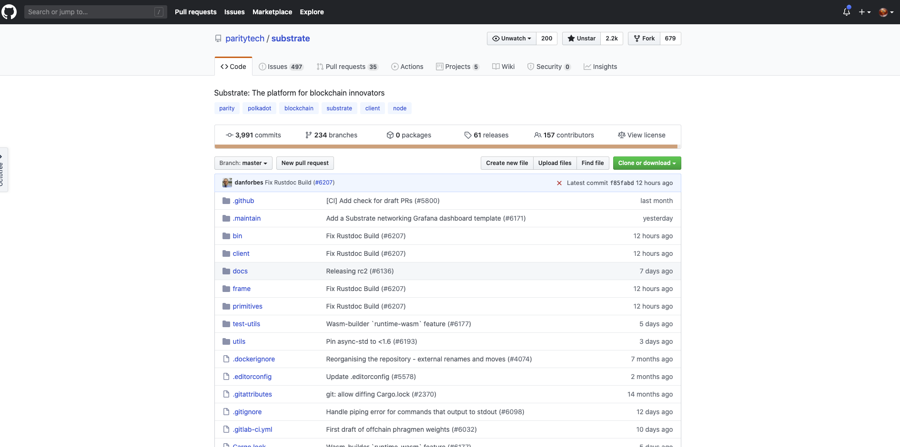
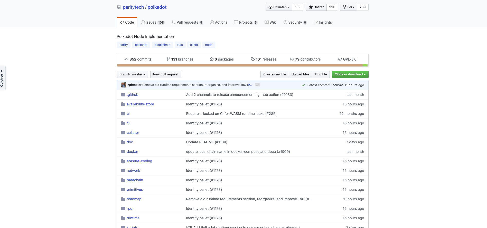
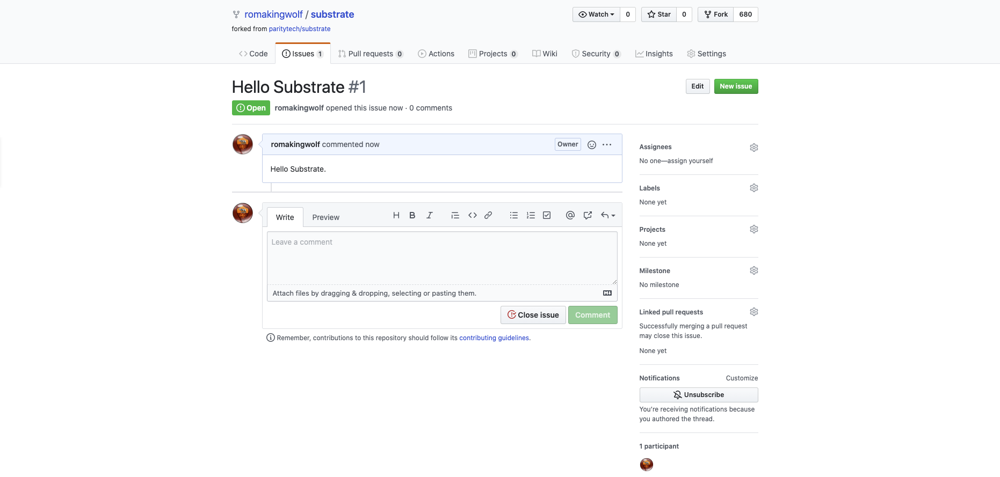
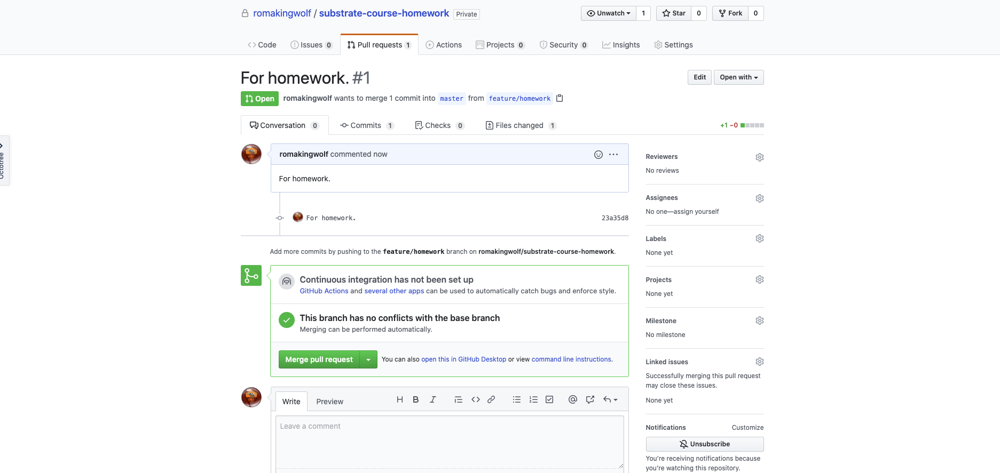
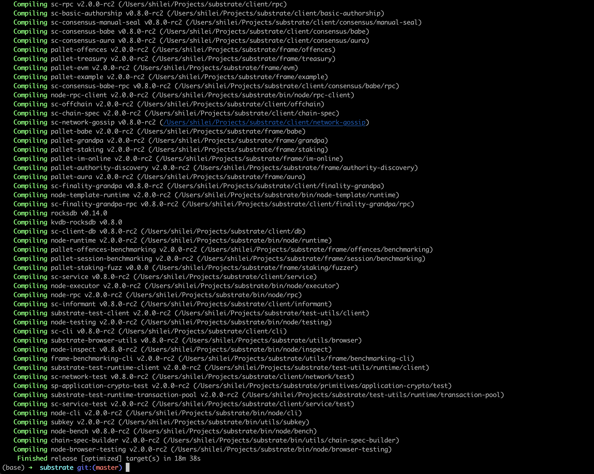
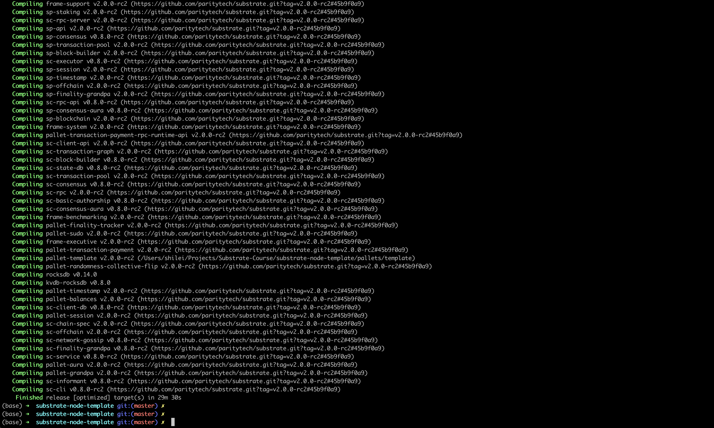
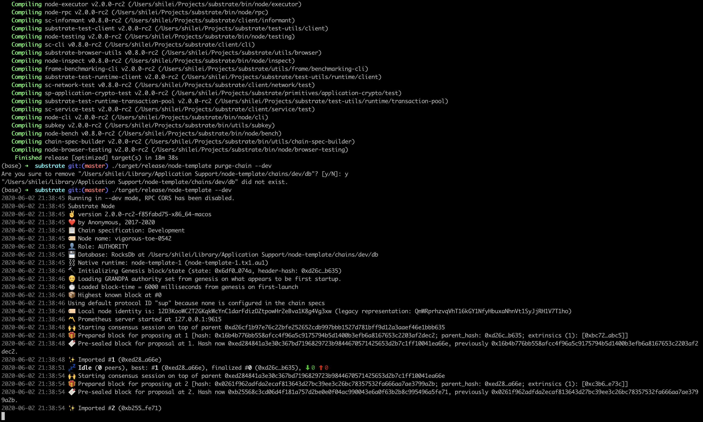
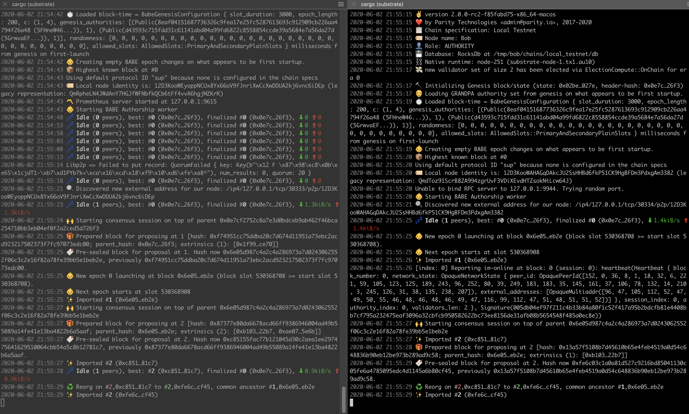
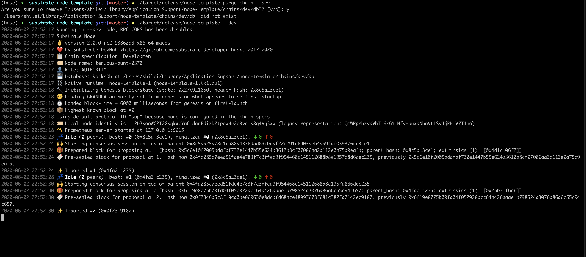
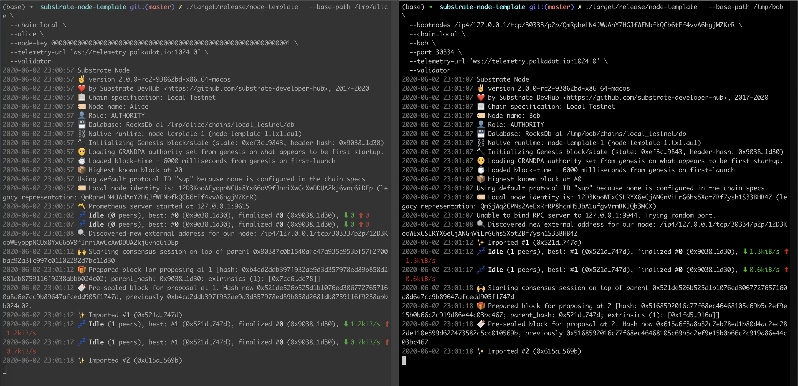

# 第一课作业答题卡

> 每一题的答案（文字/截图）请直接填写在问题下方。

#### 第一题

**请填写以下问题：（以下问题都可以在substrate官方文档里找到）**

- Substrate的官方文档网址是什么？

  https://www.substrate.io/

- Substrate的recipe网址是什么？

  https://substrate.dev/recipes/

- Substrate的rust docs的网址是什么？

  substrate.io中的rust docs链接是：（请求404）
  https://substrate.dev/rustdocs/master/sc_service/index.html
  
  加上版本号后的链接：
  https://substrate.dev/rustdocs/v2.0.0-rc2/sc_service/index.html
  
  substrate.dev中的reference docs链接是：
  https://crates.parity.io/sc_service/index.html

- Substrate的tutorial的网址是什么？

  https://www.substrate.io/tutorials

- Substrate Seminar在每周几进行？

  每周二

#### 第二题

**github的基本操作，养成良好的开源社区开发习惯**

- star和watch substrate和polkadot的repo，并截屏

  star & watch substrate:
  
  
  star & watch polkadot:
  

- fork substrate到自己的repo，并给自己的repo提一个issue和PR，并截屏

  issue:
  
  
  PR: （由于网络原因，一直无法完成clone fork的substrate repo，自己创建了一个新的repo，然后提交了一个pull request完成作业）
  

#### 第三题

**请编译第一节课中的node-template并截图编译成功的界面** (node-template链接： https://github.com/SubstrateCourse/substrate-node-template.git)

  substrate-node-template build一直卡在update substrate repo，我直接build了substrate。
  
  
  substrate-node-template build成功后：
  

#### 第四题

**请运行node-template节点并截图 ，单节点和多节点分别截图（ (node-template链接： https://github.com/SubstrateCourse/substrate-node-template.git)）**

  substrate-node-template build一直卡在update substrate repo，我直接使用了substrate build后的node-template。
  
  单节点：
  
  
  多节点：
  
  
  substrate-node-template build成功后，进行单节点、多节点运行：
  
  单节点：
  
  
  多节点：
  
