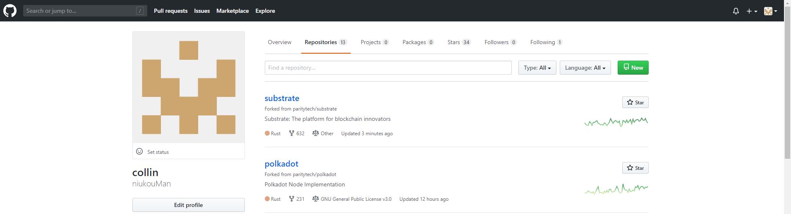
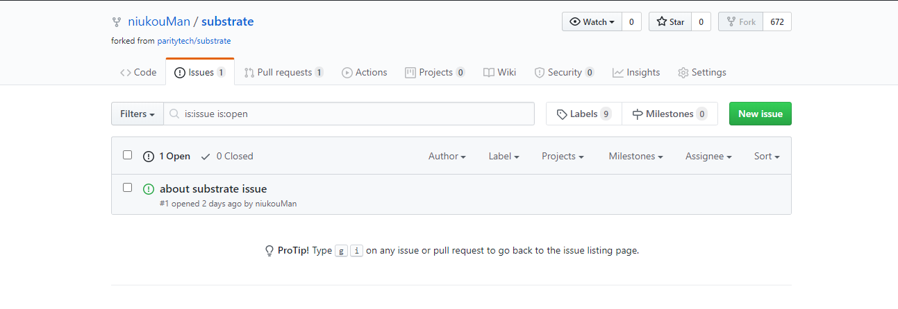
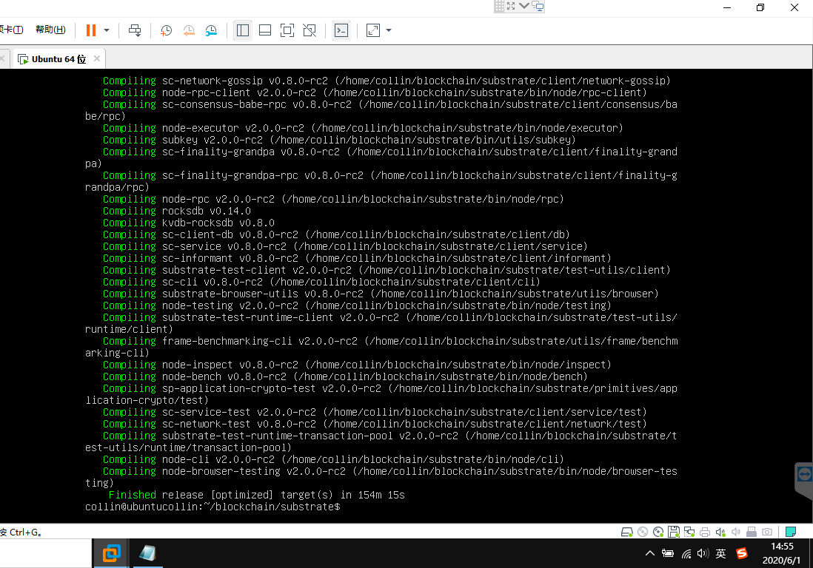
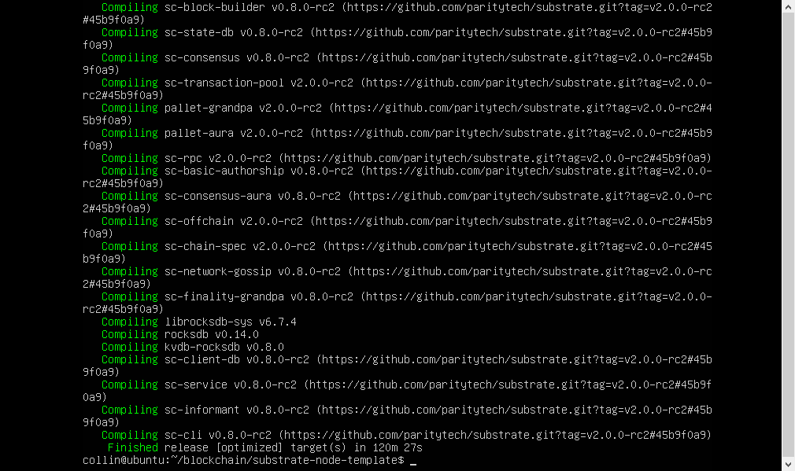
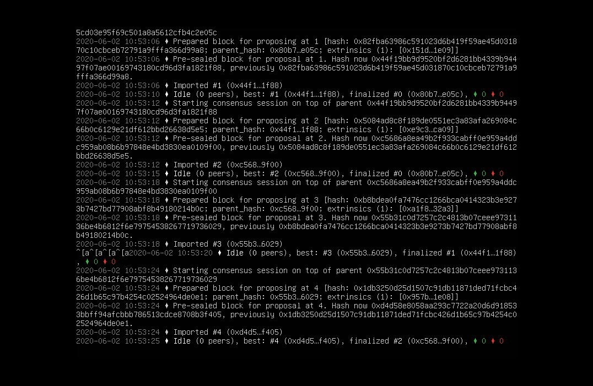
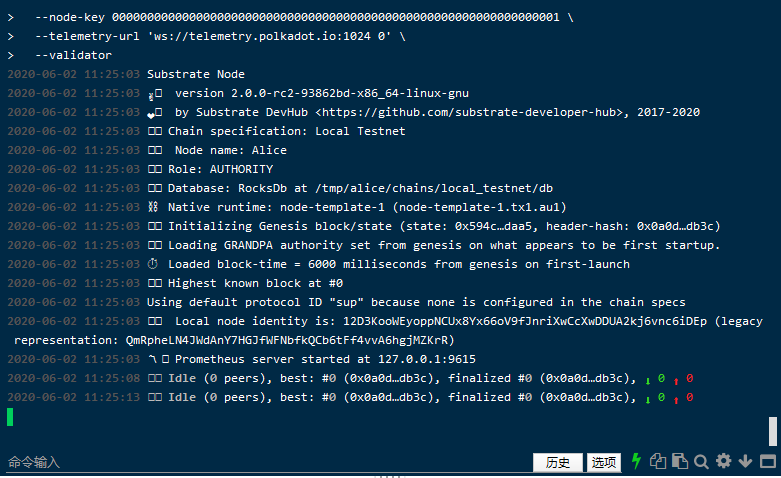
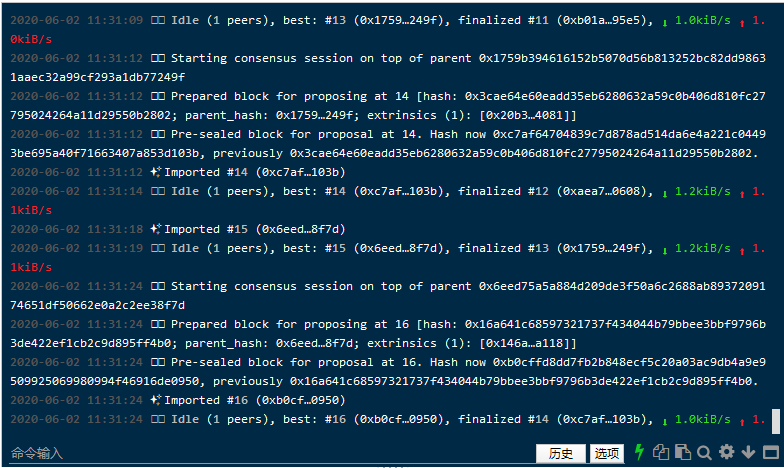
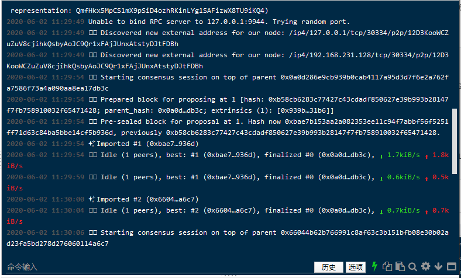

# 第一课作业答题卡

> 每一题的答案（文字/截图）请直接填写在问题下方。

#### 第一题

**请填写以下问题：（以下问题都可以在substrate官方文档里找到）**

- Substrate的官方文档网址是什么？
https://substrate.dev/docs/en/v2.0.0-alpha.3
  

- Substrate的recipe网址是什么？
https://substrate.dev/recipes
  

- Substrate的rust docs的网址是什么？
https://crates.parity.io/sc_service/index.html
  

- Substrate的tutorial的网址是什么？
https://www.substrate.io/tutorials
  

- Substrate Seminar在每周几进行？
周二，https://zoom.us/j/916767726

#### 第二题

**github的基本操作，养成良好的开源社区开发习惯**

- star和watch substrate和polkadot的repo，并截屏

- fork substrate到自己的repo，并给自己的repo提一个issue和PR，并截屏

#### 第三题

**请编译第一节课中的node-template并截图编译成功的界面** (node-template链接： https://github.com/SubstrateCourse/substrate-node-template.git)

substrate编译成功界面

node-template编译成功界面

node-template启动成功界面

#### 第四题

**请运行node-template节点并截图 ，单节点和多节点分别截图（ (node-template链接： https://github.com/SubstrateCourse/substrate-node-template.git)）**

多节点-alice启动成功界面1

多节点-alice启动成功界面2

多节点-bob启动成功界面

