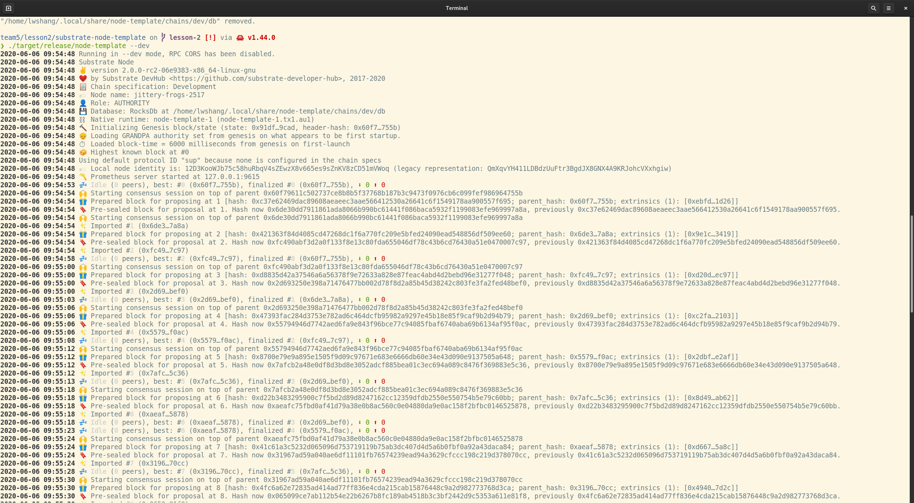
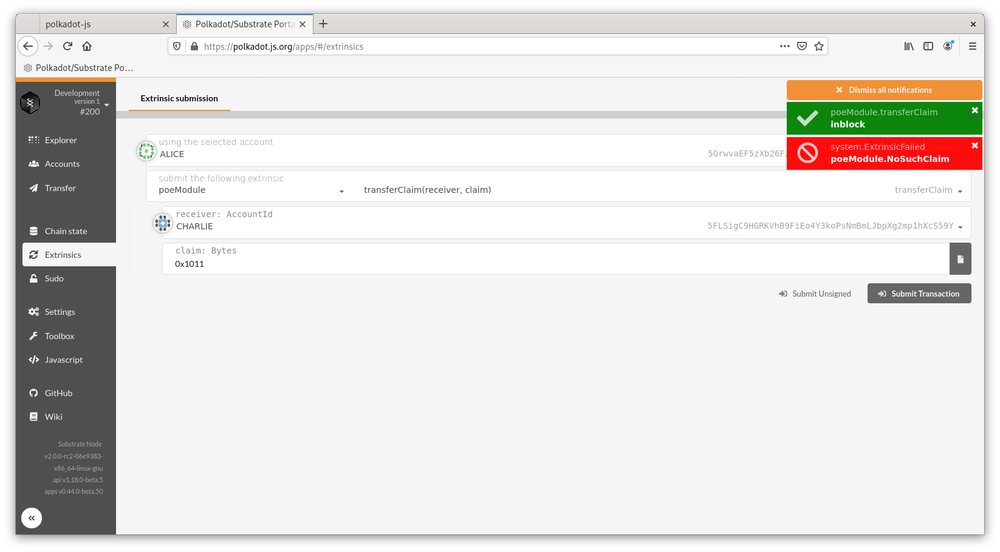
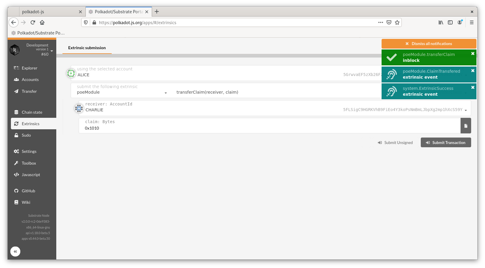
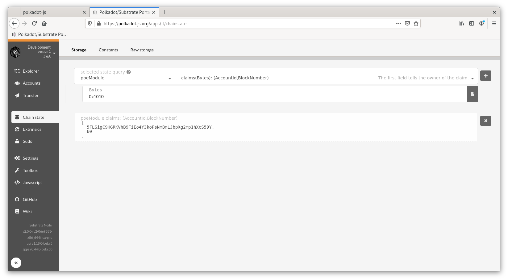
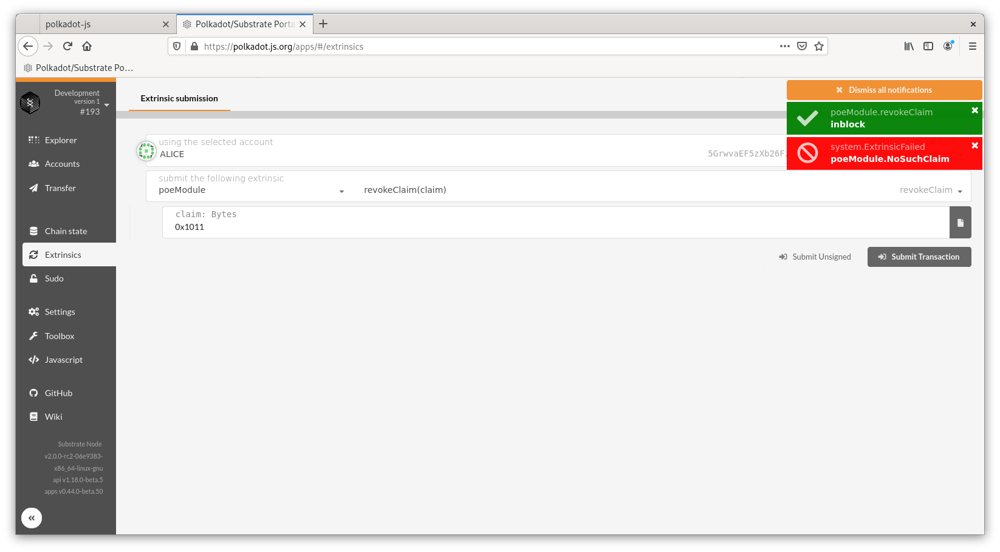
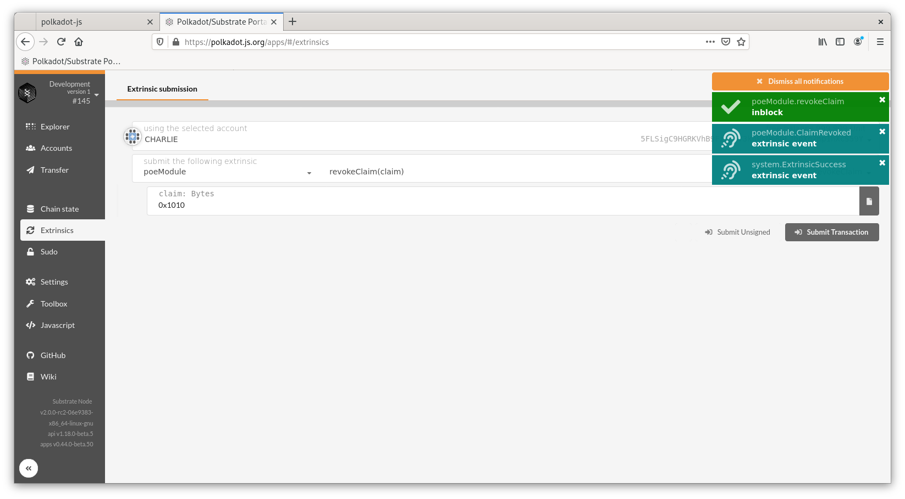

# POE pallet

## Node running

## Create claim

### Success

### Fail 

**Bonus: hash should not longer than two u8**

## Transfer claim

### Fail

#### Claim not created

#### Sender is not the owner

### Success

## Revoke claim

### Fail

#### Origin is not the owner

#### Claim not created

### Success

