## 第二课作业 PoE 1

课程里会给出参考资料，大家一定要自己敲一遍**代码**！

注：

1. 下面的题目，都需要提交源代码，程序运行的命令行截图，前端apps 发送对应交易的截图；
2. 可以尝试别的数据类型，功能满足即可；
3. 在可调用函数里要有合理的检查；操作成功要触发事件；
4. 附加题不是必答的，但可以酌情加分。

**第一题：实现存证模块的功能，包括：**

* 创建存证，可调用函数所接收参数为内容的哈希值 Vec<u8>；
* 撤销存证，可调用函数所接收参数为内容的哈希值 Vec<u8>。

**第二题：为存证模块添加新的功能，**

* 转移存证，接收两个参数，一个是内容的哈希值，另一个是存证的接收账户地址；当存证不存在或者发送请求的用户不是存证内容的拥有人时，返回错误；当所有的检查通过后，更新对应的存证记录，并触发一个事件。

**第三题（附加题）：**

* 创建存证时，为存证内容的哈希值设置界限，如果超出界限，返回错误。


### 编译

```
cargo build
```

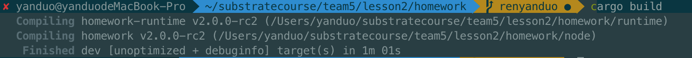

### 运行

```
./target/debug/homework --dev
```

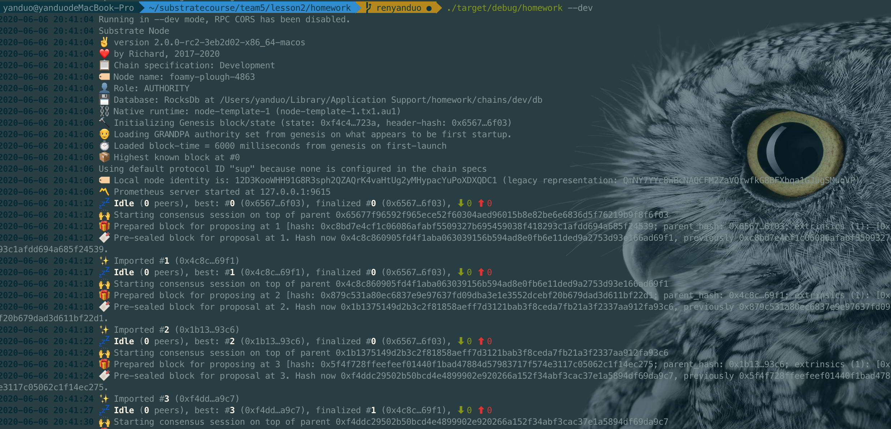

### 交易

```
浏览器
https://polkadot.js.org/apps/#/explorer
```

导入script/homework.json

```
{
    "ProofInfo":{
        "claimer": "AccountId",
        "owner": "AccountId",
        "claim_block": "BlockNumber"
    }
}
```

##### 1.创建存证

1)检查：存证内容的哈希值长度不得低于4bytes

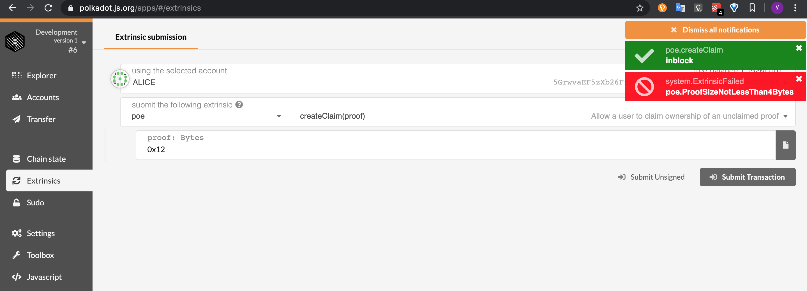

2)创建存证

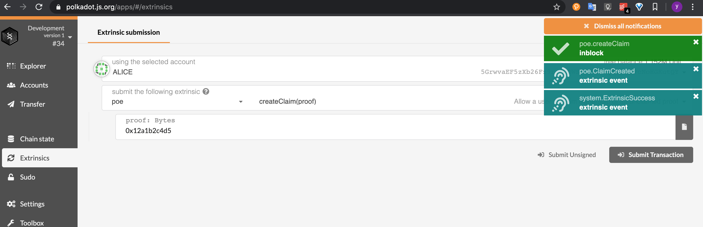

3)查询存证信息

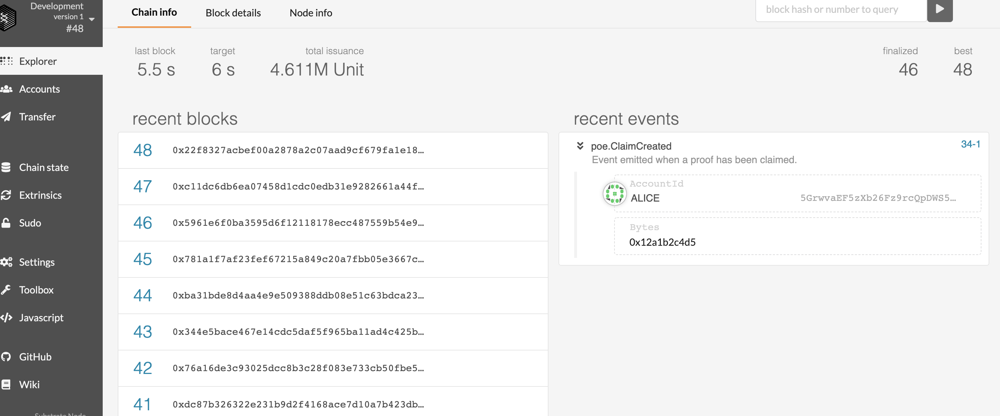

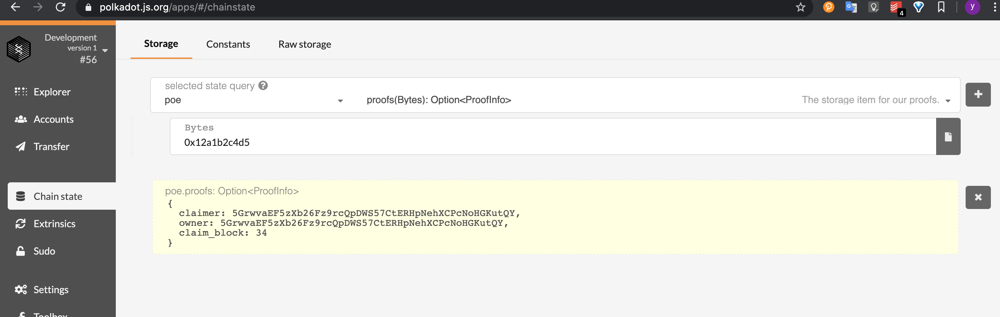


##### 2.撤销存证

1)检查

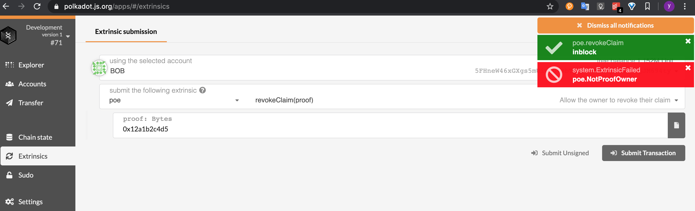

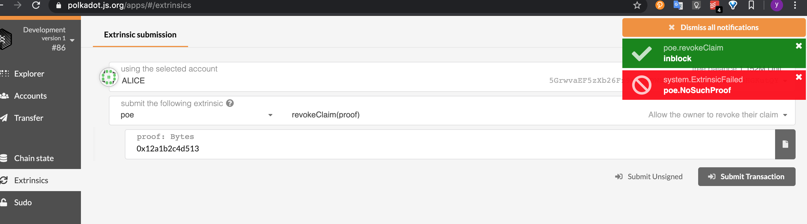

2)撤销存证

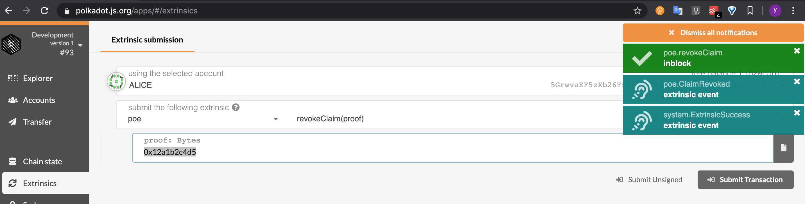

3)查询存证信息

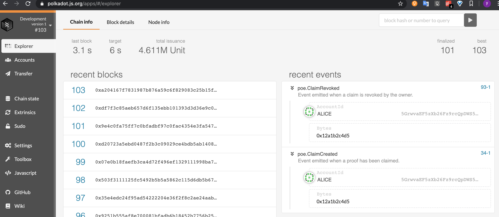

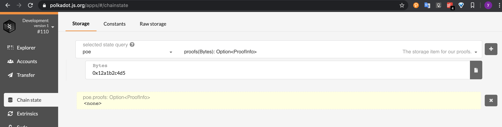


##### 3.转移存证

1)检查

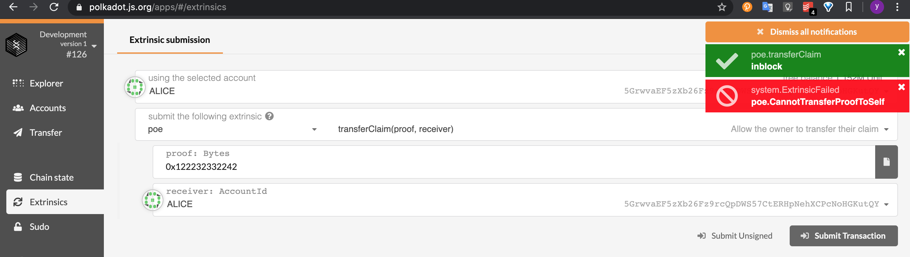

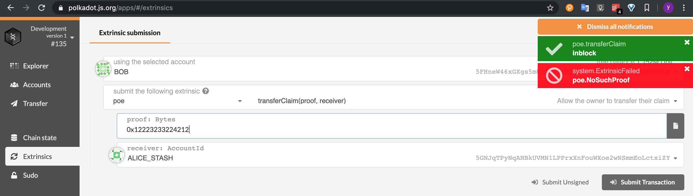

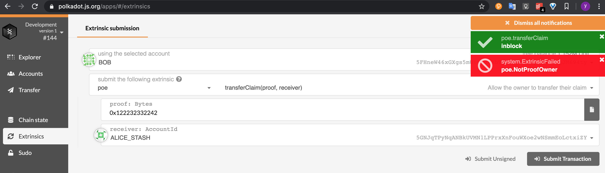

2)查询存证信息

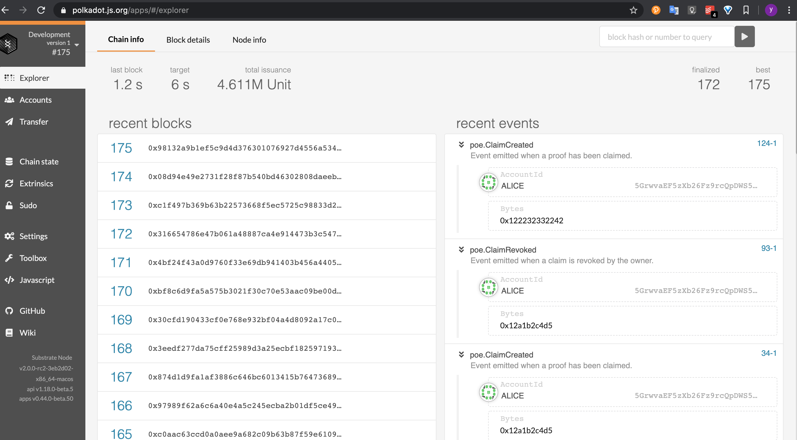

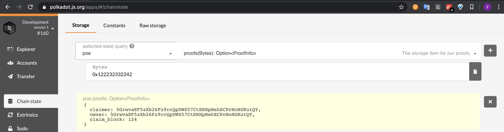

3)转移存证


4)查询存证信息

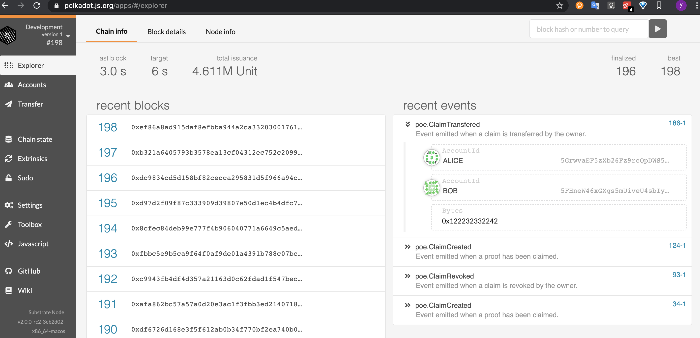

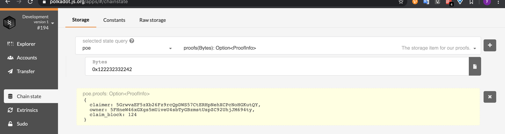

### 参考资料

["Proof Of Existence" dApp](https://www.substrate.io/tutorials/build-a-dapp/v2.0.0-rc2)

[Rust pattern match](https://doc.rust-lang.org/book/ch18-00-patterns.html)

[Enum](https://doc.rust-lang.org/book/ch06-01-defining-an-enum.html)

[Recoverable Errors with Result](https://doc.rust-lang.org/book/ch09-02-recoverable-errors-with-result.html)

[Generic Types, Traits](https://doc.rust-lang.org/book/ch10-00-generics.html)