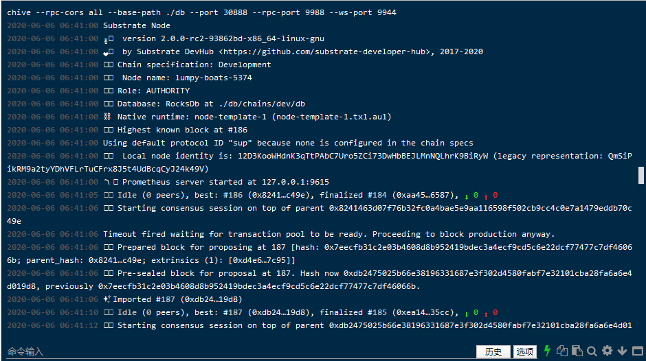

## 第二课作业 PoE 1

**第一题：实现存证模块的功能，包括：**

* 创建存证，可调用函数所接收参数为内容的哈希值 Vec<u8>；

build

run

create claim

create claim

* 撤销存证，可调用函数所接收参数为内容的哈希值 Vec<u8>。

revoke claim error

revoke claim success

**第二题：为存证模块添加新的功能，**

* 转移存证，接收两个参数，一个是内容的哈希值，另一个是存证的接收账户地址；
当存证不存在或者发送请求的用户不是存证内容的拥有人时，返回错误；
当所有的检查通过后，更新对应的存证记录，并触发一个事件。

build send_claim success

send claim success

send claim fail not owner

**第三题（附加题）：**

* 创建存证时，为存证内容的哈希值设置界限，如果超出界限，返回错误。

### 参考资料

["Proof Of Existence" dApp](https://www.substrate.io/tutorials/build-a-dapp/v2.0.0-rc2)

[Rust pattern match](https://doc.rust-lang.org/book/ch18-00-patterns.html)

[Enum](https://doc.rust-lang.org/book/ch06-01-defining-an-enum.html)

[Recoverable Errors with Result](https://doc.rust-lang.org/book/ch09-02-recoverable-errors-with-result.html)

[Generic Types, Traits](https://doc.rust-lang.org/book/ch10-00-generics.html)