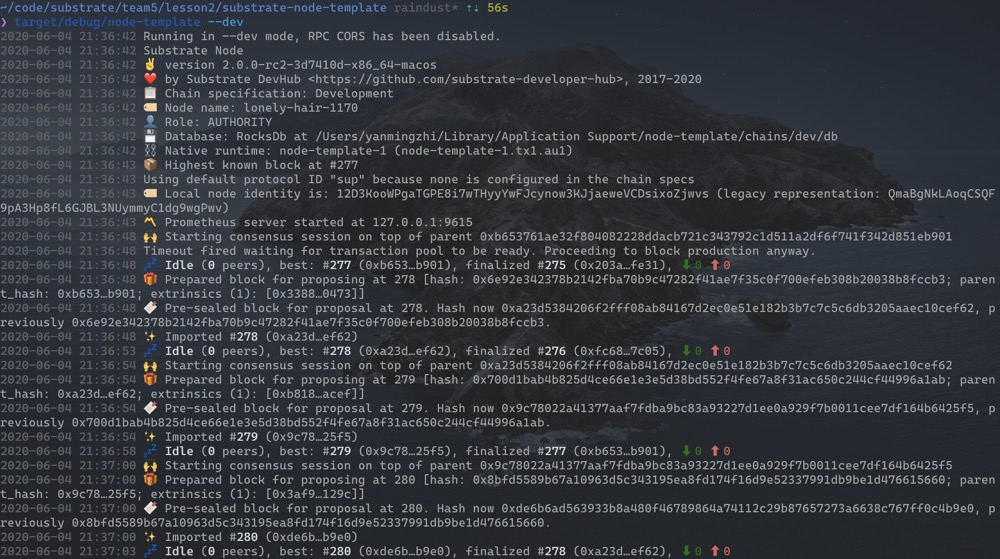
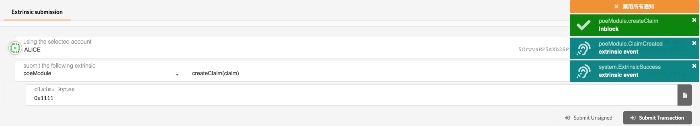
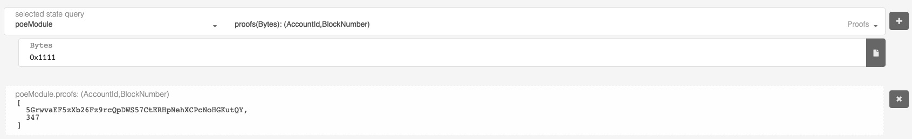
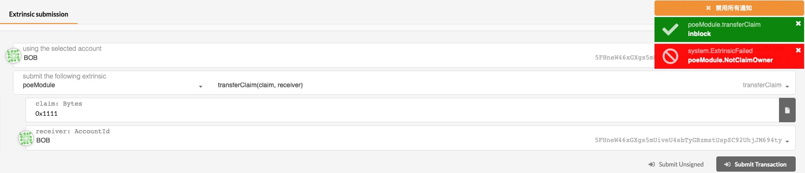
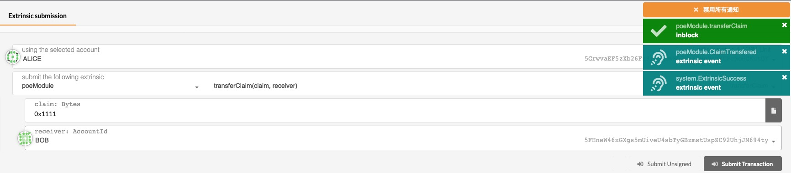
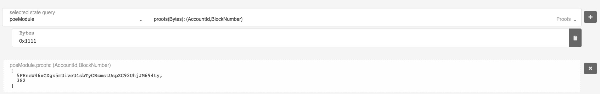
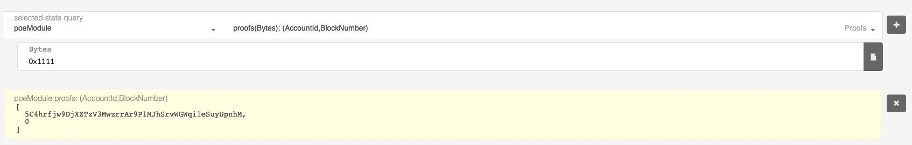
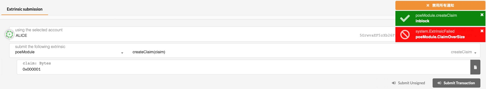

1. 启动节点（为了提高编译速度这里启动的是debug版本）：

2. 由Alice创建一个凭证：

   

3. 查询凭证创建成功：

4. 非Alice本人转移该凭证会失败：

   

5. 将凭证转移给Bob：

   

6. 查询并确认凭证已成功转移：

   

7. Bob吊销凭证：

   

8. 查询并确认凭证已吊销成功：

   

9. **【附加题】凭证长度超过16比特会报错**

   