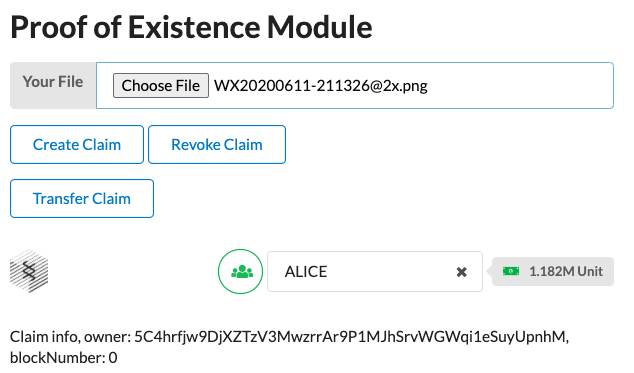
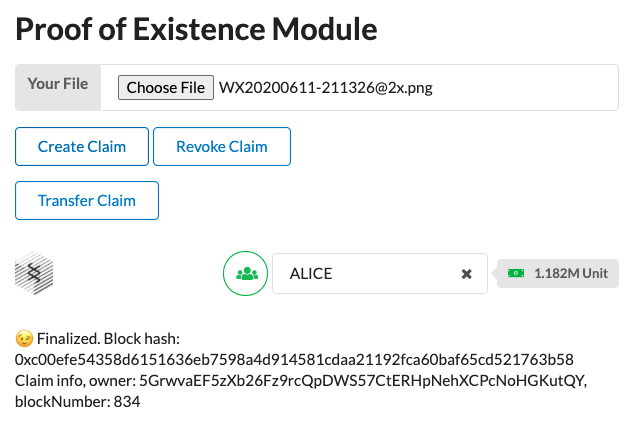
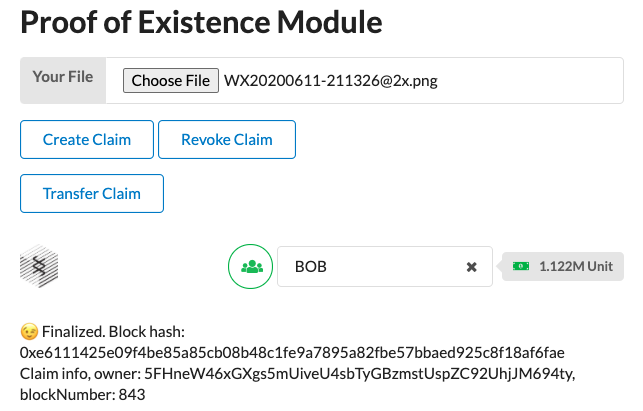
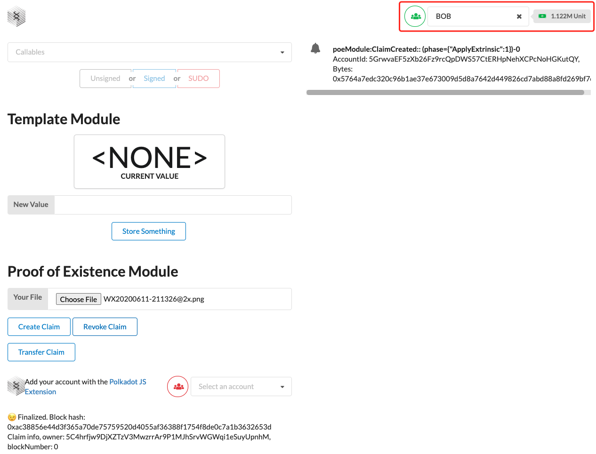

1. 编写完创建、转移、销毁凭证相关单元测试，运行结果如下：

   

2. 运行节点和前端程序，在浏览器上选择一个图片作为凭证所属物，界面显示如下：

   

3. 创建该凭证，最终区块确认后界面显示如下：

   

4. 将该凭证从Alice转移给Bob，最终区块确认后界面显示如下：

   

5. 用Bob账户吊销凭证，最终区块确认后界面显示如下：

   

6. 【附加题】编写拍卖和购买凭证的逻辑，单元测试运行界面如下（拍卖和购买逻辑已在https://polkadot.js.org/apps 上成功测试，前端页面限于时间关系暂未实现）：

   

