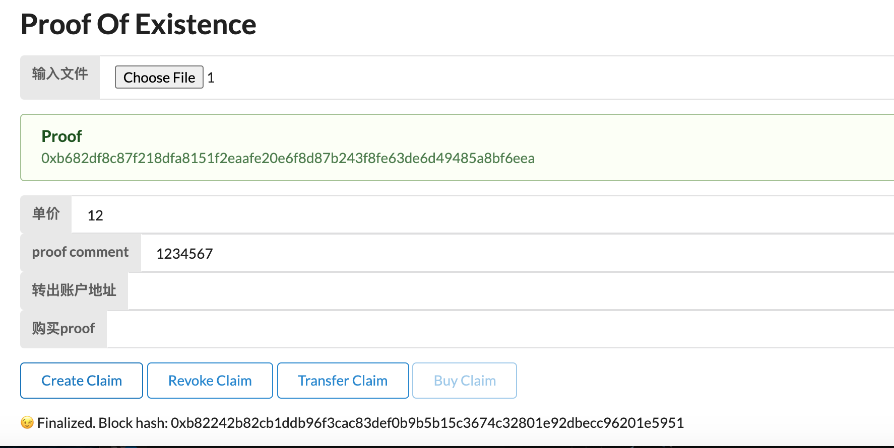
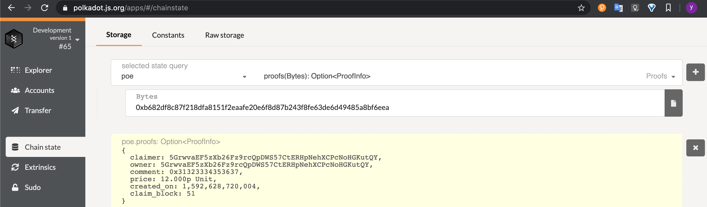
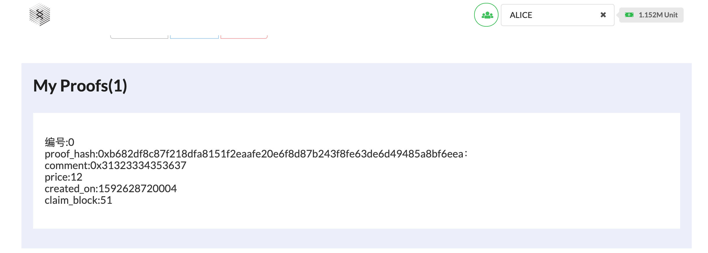
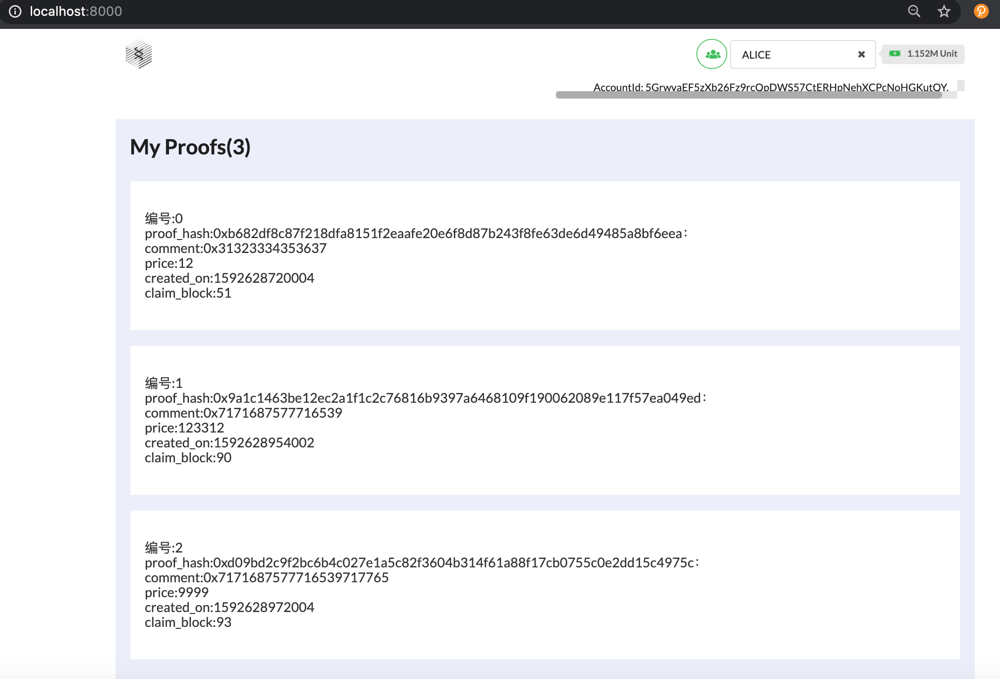
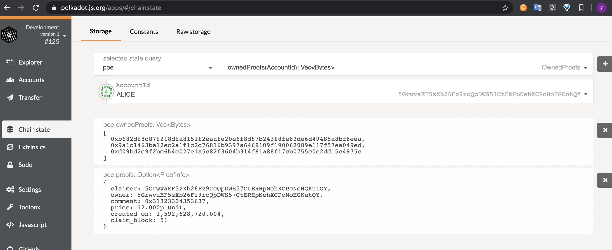

## 第四课作业


##### 编译

```
cargo build
```

##### 测试

```
cargo test
```

**运行**

```
./target/debug/homework --dev
```

**交易**

```
自带浏览器https://polkadot.js.org/apps/#/explorer
导入script/homework.json
{
     "ProofInfo":{
        "claimer": "AccountId",
        "owner": "AccountId",
        "comment": "Vec<u8>",
        "price": "Balance",
        "created_on":"Moment",
        "claim_block": "BlockNumber"
    }
}
```

```
UI http://localhost:8000/
yarn install
yarn start
```

###### 1.创建存证

1.1 ui Alice创建存证



1.2自带浏览器查询   

1.3Ui-list



2.存证列表

Alice多次操作后。。。

2.1 ui 



2.2自带浏览器查询   




