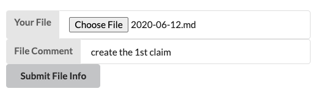
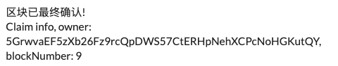
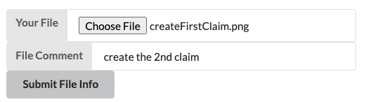
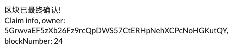
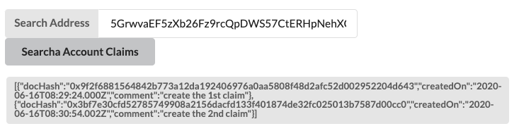

1. 根据lesson3中的节点源码修改逻辑，编译并运行单元测试，运行结果如下：

   

2. 运行节点和前端程序，在浏览器上创建第一个凭证并添加备注，界面显示如下：

   

3. 创建该凭证，最终区块确认后界面显示如下（状态内容更改为中文以区别上一课中添加的信息）：

   

4. 在浏览器上创建第二个凭证并添加备注，界面显示如下：

   

5. 创建该凭证，最终区块确认后界面显示如下：

   

6. 【附加题】上述步骤中的凭证都是由Alice创建，这里传入Alice的地址查询凭证的相关信息界面显示如下：

   

由于时间原因目前只完成了基本功能，以下列出待改进的地方：

- 节点逻辑中，当转移凭证、购买凭证成功后，完成对账户-文档信息map的更新
- UI界面优化
- 查询某个账户下的所有凭证时，以列表形式展示

