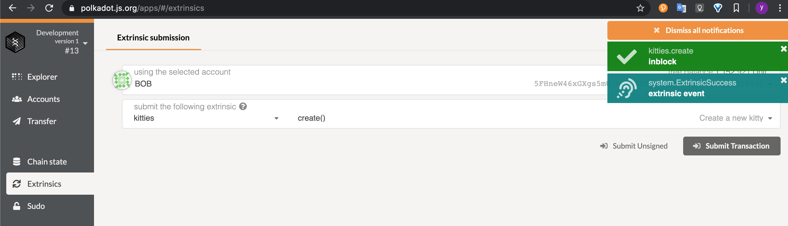
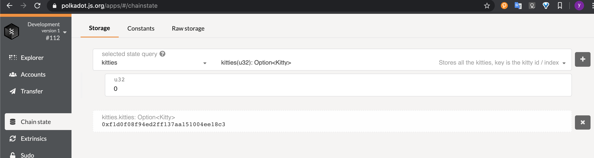
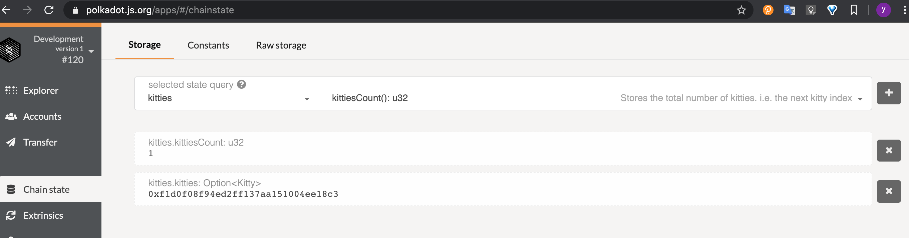
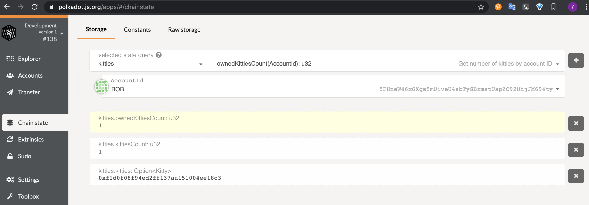
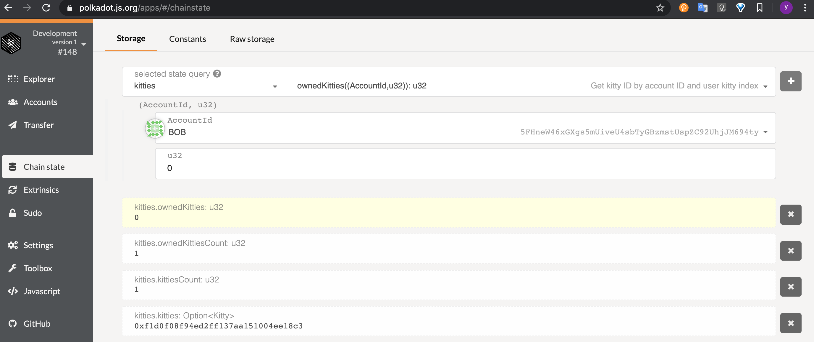
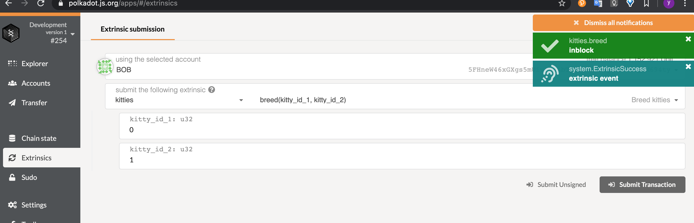
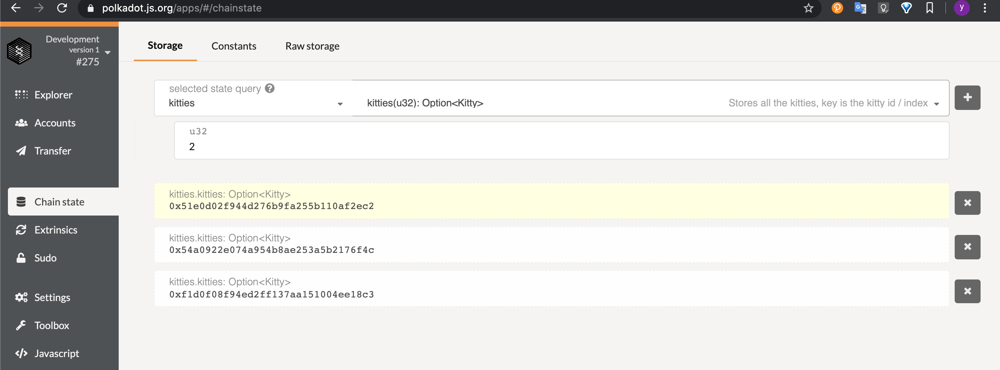

## 第四课作业

作业1

```
Self::insert_kitty(sender, kitty_id, kitty)
```

作业2

```
let nonce = Self::kitties_count();
let random_seed = <pallet_randomness_collective_flip::Module<T>>::random_seed();
let encoded = (random_seed, sender.clone(), nonce).encode();
		
blake2_128(&encoded)
```

作业3

```
<Kitties>::insert(kitty_id.clone(), &kitty);
<KittiesCount>::put(Self::kitties_count()+1);
<OwnedKitties<T>>::insert((owner.clone(), Self::owned_kitties_count(owner.clone())+1), kitty_id );
<OwnedKittiesCount<T>>::insert(owner.clone(),Self::owned_kitties_count(owner.clone())+1);
```


##### 编译

```
cargo build
```

**运行**

```
./target/debug/node-template --dev
```

**交易**

```
自带浏览器https://polkadot.js.org/apps/#/explorer
```

###### 1.创建kitty



###### 自带浏览器查询

kitties.kitties: Option<Kitty>

###### 

kitties.kittiesCount



kitties.ownedKittiesCount: u32



kitties.ownedKitties: u32



###### 2繁殖kitty




自带浏览器查询,查询生成的编号2的kitty




