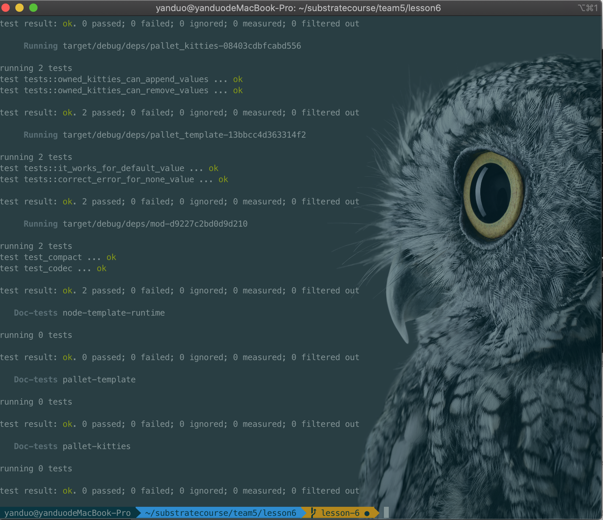
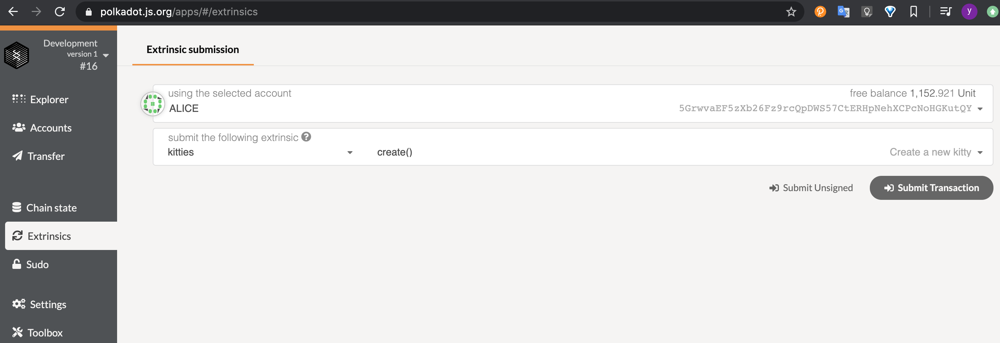
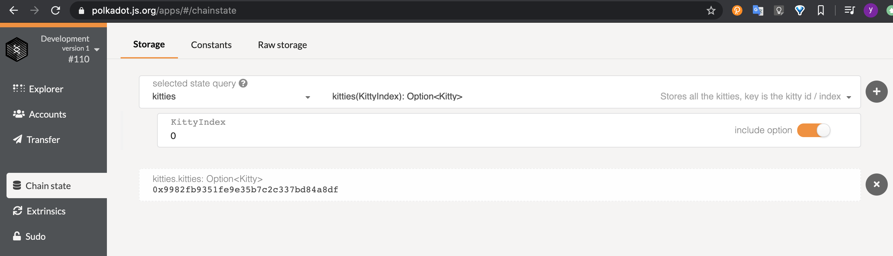
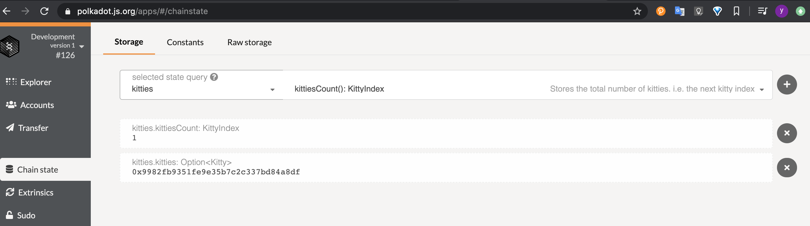
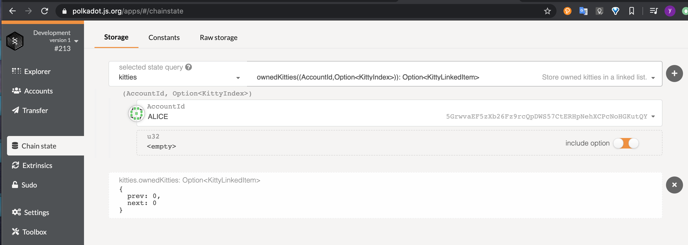
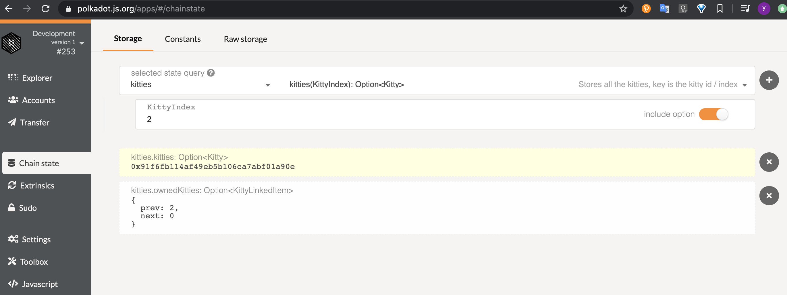
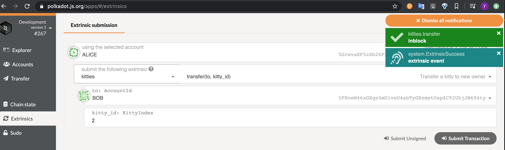
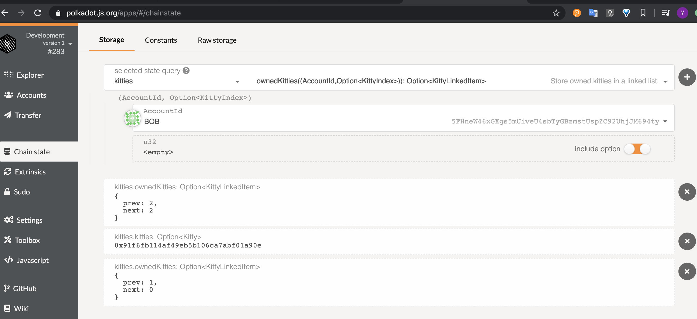

## 第五课作业

作业1

```
let sender = ensure_signed(origin)?;
ensure!(OwnedKitties::<T>::contains_key(&(sender.clone(), Some(kitty_id))),Error::<T>::RequireOwner);
<OwnedKitties<T>>::remove(&sender, kitty_id);
<OwnedKitties<T>>::append(&to, kitty_id);	
```

作业2

```
OwnedKitties::<T>::append(&owner, kitty_id);
```

作业3

```
new_test_ext().execute_with(|| {

	OwnedKittiesTest::append(&0, 1);
	OwnedKittiesTest::append(&0, 2);
	OwnedKittiesTest::append(&0, 3);

	OwnedKittiesTest::remove(&0, 1);
	assert_eq!(OwnedKittiesTest::get(&(0, Some(2))), Some(KittyLinkedItem {
		prev: None,
		next: Some(3),
	}));
	assert_eq!(OwnedKittiesTest::get(&(0, Some(3))), Some(KittyLinkedItem {
		prev: Some(2),
		next: None,
	}));
			

	OwnedKittiesTest::remove(&0, 2);
	assert_eq!(OwnedKittiesTest::get(&(0, Some(3))), Some(KittyLinkedItem {
		prev: None,
		next: None,
		}));

	assert_eq!(OwnedKittiesTest::get(&(0, None)), Some(KittyLinkedItem {
		prev: Some(3),
		next: Some(3),
	}));

	OwnedKittiesTest::remove(&0, 3);
	assert_eq!(OwnedKittiesTest::get(&(0, None)), Some(KittyLinkedItem {
		prev: None,
		next: None,
	}));
});
```


###### **测试**

```
cargo test
```



###### 编译

```
cargo build
```

###### **清除历史数据**

```
./target/debug/node-template purge-chain --dev
```

###### **运行**

```
./target/debug/node-template --dev
```

###### **交易**

```
自带浏览器https://polkadot.js.org/apps/#/explorer
导入./scripts/kitties.json
{
    "KittyIndex": "u32",
    "Kitty": "[u8; 16]",
    "KittyLinkedItem":{
        "prev": "Option<KittyIndex>",
        "next": "Option<KittyIndex>"
    }
}
```

###### 1.创建kitty



自带浏览器查询

kitties(KittyIndex): Option<Kitty>

###### 

kittiesCount(): KittyIndex



ownedKitties((AccountId,Option<KittyIndex>)): Option<KittyLinkedItem>



###### 2繁殖kitty

0,1生成编号2的kitty.并用自带浏览器查询



###### 3转移kitty Alice->Bob



自带浏览器查询,查询bob下的kitty

