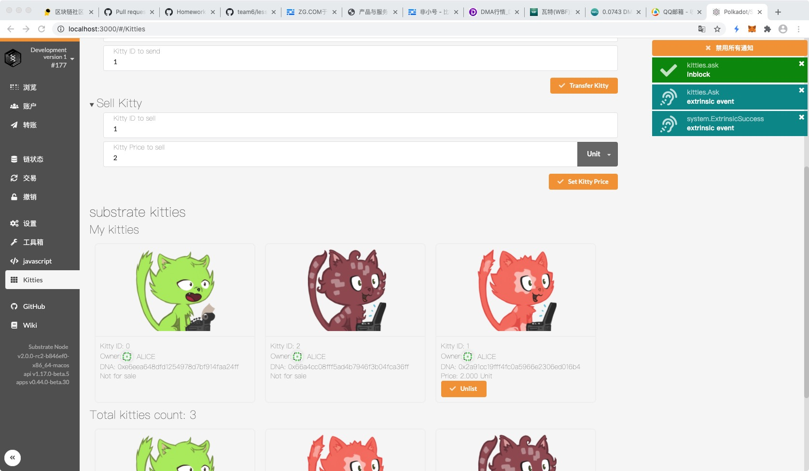
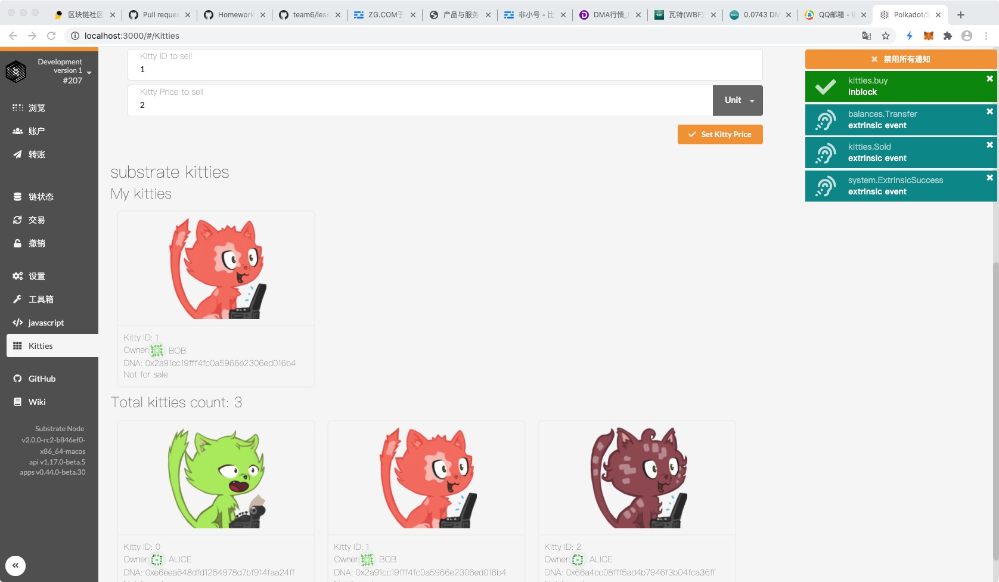

### 第七课作业

### 1. 补完剩下的代码 https://github.com/SubstrateCourse/team5/blob/master/lesson7/pallets/kitties/src/linked_item.rs

### 2. 修复单元测试

a.编译

b.整体测试

c.模块测试

d.运行

e.前端

f.创建小猫

e.繁殖小猫

g.出售小猫

h.购买小猫

### 3. 阅读 pallet-membership
	
a. 分析 add_member 的计算复杂度

答：函数的计算复杂度由搜索插入的binary_search/insert和排序的change_members_sorted来决定。
   其中搜索的复杂度为O(logN)，排序复杂度为O(N)，总复杂度为O(logN)+O(N)。
	
b. 分析 pallet-membership 是否适合以下场景下使用，提供原因
	
	​	i. 储存预言机提供者
	
	​	ii. 储存游戏链中每个工会的成员
	
	​	iii. 储存 PoA 网络验证人

答：pallet-membership提供一个成员队列和一个主成员功能，其增删操作具有较大的复杂度。所以，适合相对固定的成员，并有主成员需求的场景。
  i和iii的成员数量相对少且固定，适合；ii由于工会成员数量可能非常庞大，并不适合。
	
	
