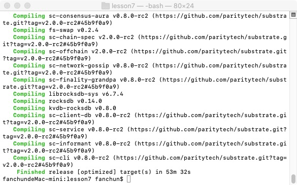
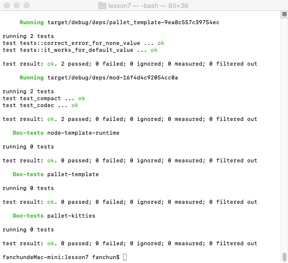
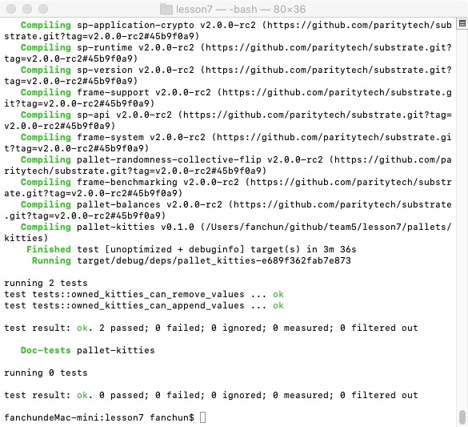
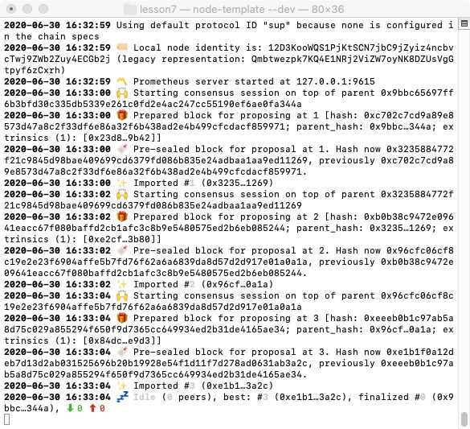
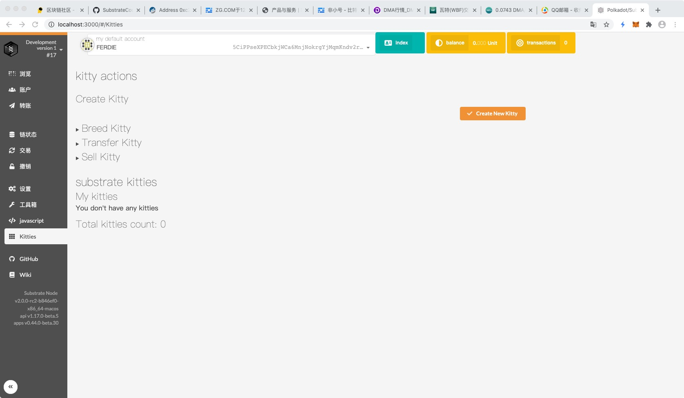
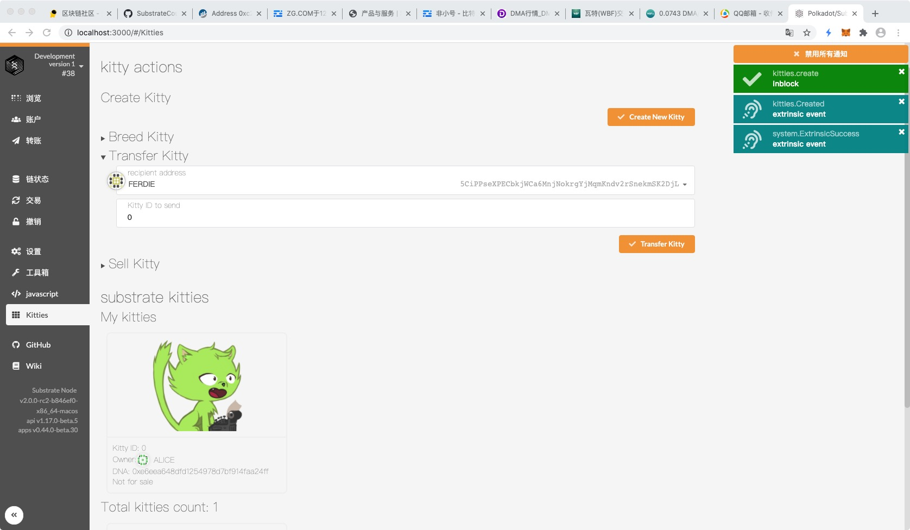
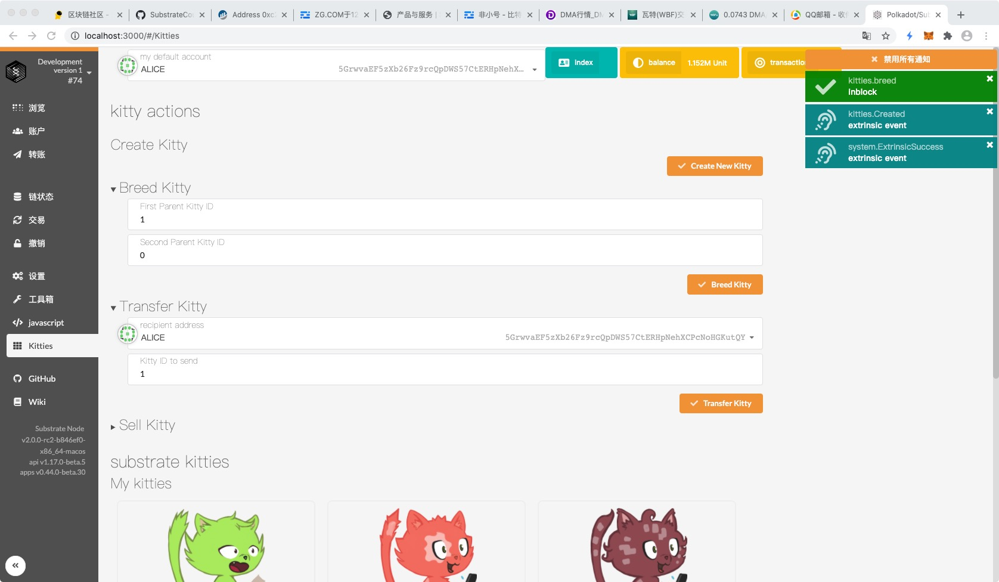

### 第七课作业

### 1. 补完剩下的代码 https://github.com/SubstrateCourse/team5/blob/master/lesson7/pallets/kitties/src/linked_item.rs

### 2. 修复单元测试

a.编译

b.整体测试

c.模块测试

d.运行

e.前端

f.创建小猫

e.繁殖小猫

### 3. 阅读 pallet-membership
	
	a. 分析 add_member 的计算复杂度
	
	b. 分析 pallet-membership 是否适合以下场景下使用，提供原因
	
	​	i. 储存预言机提供者
	
	​	ii. 储存游戏链中每个工会的成员
	
	​	iii. 储存 PoA 网络验证人
	
	
