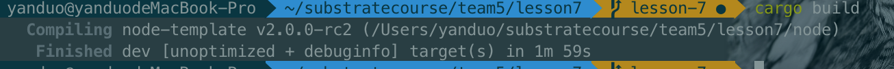
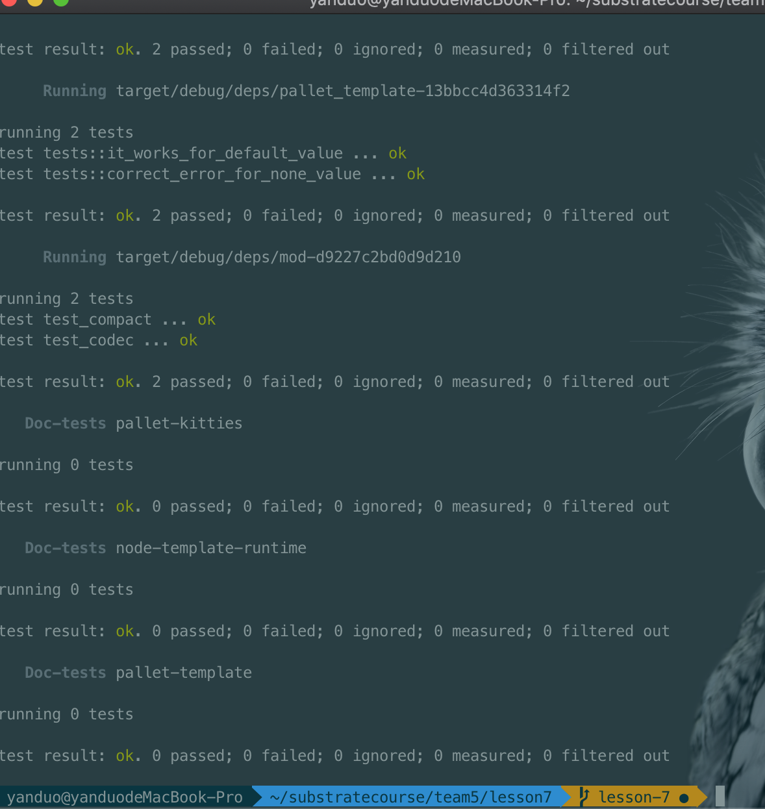

## 第七课作业

作业1

team5/lesson7/pallets/kitties/src/linked_item.rs


```
let head = Self::read_head(key);
		let new_head = LinkedItem {
			prev: Some(value),
			next: head.next,
		};

		Self::write_head(key, new_head);

		let prev = Self::read(key, head.prev);
		let new_prev = LinkedItem {
			prev: prev.prev,
			next: Some(value),
		};
		Self::write(key, head.prev, new_prev);

		let item = LinkedItem {
			prev: head.prev,
			next: None,
		};
		Self::write(key, Some(value), item);
```


```
if let Some(item) = Storage::take((&key, Some(value))) {
			let prev = Self::read(key, item.prev);
			let new_prev = LinkedItem {
				prev: prev.prev,
				next: item.next,
			};

			Self::write(key, item.prev, new_prev);

			let next = Self::read(key, item.next);
			let new_next = LinkedItem {
				prev: item.prev,
				next: next.next,
			};

			Self::write(key, item.next, new_next);
		}
```

作业2

team5/lesson7/pallets/kitties/src/lib.rs

##### 编译

```
cargo build
```



##### 测试

```
cargo test
```



作业3

```
1.分析 add_member 的计算复杂度 
  O(MP + N + logN)
2.分析 pallet-membership 是否适合以下场景下使用,提供原因
储存预言机提供者               适合，成员基本固定，且修改不频繁
储存游戏链中每个工会的成员       不适合，游戏人数太多, 且修改频繁
储存 PoA 网络验证人            适合，验证人相对较少，基本固定，且修改不频繁
```

